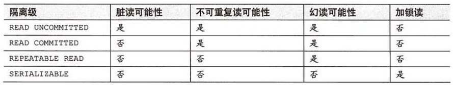

# DataBase

    varchar(n)
        Capacity < 5.0.3 ? Unit = 字节 :(else) Unit = 字符

## 索引

    目录页 - 页目录 - 页 - 二分法
    根据 主键 - (if null) 唯一索引 - (if null) 默认生成rowid 建立 B+树

    建议自增id作为主键，提升存储效率（使用更少的页作为索引）

    建立过程

        第一页

        copy第一页 -> 开辟第二页，第一页改为目录页（起始页不变）

    辅助索引

        create index idx_t_bcd on t(b, c, d) 联合索引，按序排序
        辅助索引找到后回到主键索引取数据 或 全表暴力搜索

        explain关键字

    比较规则

        bin, 字符集......

    使用索引

        最左前缀原则

## 事务4大特性 mysql如何保证实现

    Atomicity 原子性
        一系列操作要么都成功，要么都失败

    Isolation 隔离型
        事务之间相互隔离，互不影响

    Consistency
        总数据的一致性，总数据保持既定的约束

    Durability
        记录永久保存

    事务

        autocommit 事务自动提交

        START TRANSACTION;
        ...
        commit;

    隐式提交

        特定语句执行会自动commit (定义或修改数据库对象的数据定义语言)
        ALTER TABLE, CREATE USER, DROP USER, GRANT, RENAME USER, SET PASSWORD,
        LOCK TABLES, UNLOCK TABLES,
        LOAD DATA,
        ANALYZE TABLE, CACHE INDEX, CHECK TABLE, FLUSH, LOAD INDEX INTO CACHE, OPTIMIZE TABLE

    保存点

        只回滚到保存点

        SAVEPOINT 保存点名称;
        ROLLBACK [WORK] TO [SAVEPOINT] 保存点名称;
        RELEASE SAVEPOINT 保存点名称;

## 事务隔离级别

### 脏读

    所谓脏读，就是指事务A读到了事务B还没有提交的数据，比如银行取钱，事务A开启事务，此时切换到事务B，事务B开启事务-->取走100元，此时切换回事务A，事务A读取的肯定是数据库里面的原始数据，因为事务B取走了100块钱，并没有提交，数据库里面的账务余额肯定还是原始余额，这就是脏读。

### 不可重复读

    所谓不可重复读，就是指在一个事务里面读取了两次某个数据，读出来的数据不一致。还是以银行取钱为例，事务A开启事务-->查出银行卡余额为1000元，此时切换到事务B事务B开启事务-->事务B取走100元-->提交，数据库里面余额变为900元，此时切换回事务A，事务A再查一次查出账户余额为900元，这样对事务A而言，在同一个事务内两次读取账户余额数据不一致，这就是不可重复读。

### 幻读

    所谓幻读，就是指在一个事务里面的操作中发现了未被操作的数据。比如学生信息，事务A开启事务-->修改所有学生当天签到状况为false，此时切换到事务B，事务B开启事务-->事务B插入了一条学生数据，此时切换回事务A，事务A提交的时候发现了一条自己没有修改过的数据，这就是幻读，就好像发生了幻觉一样。幻读出现的前提是并发的事务中有事务发生了插入、删除操作。

### DEFAULT

    默认隔离级别，每种数据库支持的事务隔离级别不一样，那么将使用底层数据库的默认事务隔离级别。

### READ_UNCOMMITTED

    读未提交，即能够读取到没有被提交的数据，所以很明显这个级别的隔离机制无法解决脏读、不可重复读、幻读中的任何一种，因此很少使用

### READ_COMMITED

    读已提交，即能够读到那些已经提交的数据，自然能够防止脏读，但是无法限制不可重复读和幻读

### REPEATABLE_READ

    重复读取，即在数据读出来之后加锁，类似"select * from XXX for update"，明确数据读取出来就是为了更新用的，所以要加一把锁，防止别人修改它。REPEATABLE_READ的意思也类似，读取了一条数据，这个事务不结束，别的事务就不可以改这条记录，这样就解决了脏读、不可重复读的问题，但是幻读的问题还是无法解决

### SERLALIZABLE

    串行化，最高的事务隔离级别，不管多少事务，挨个运行完一个事务的所有子事务之后才可以执行另外一个事务里面的所有子事务，这样就解决了脏读、不可重复读和幻读的问题了。

不是事务隔离级别设置得越高越好，事务隔离级别设置得越高，意味着势必要花手段去加锁用以保证事务的正确性，那么效率就要降低，因此实际开发中往往要在效率和并发正确性之间做一个取舍，一般情况下会设置为READ_COMMITED，此时避免了脏读，并发性也还不错，之后再通过一些别的手段去解决不可重复读和幻读的问题就好了。

## Mysql默认隔离级别与并发安全

    repeatable-read 可重复读
    为什么？
        采用读未提交(Read UnCommitted),一个事务读到另一个事务未提交读数据，这个不用多说吧，从逻辑上都说不过去！
        采用串行化(Serializable)，每个次读操作都会加锁，快照读失效，一般是使用mysql自带分布式事务功能时才使用该隔离级别！(笔者从未用过mysql自带的这个功能，因为这是XA事务，是强一致性事务，性能不佳！互联网的分布式方案，多采用最终一致性的事务解决方案！)
        在RR隔离级别下，存在间隙锁，导致出现死锁的几率比RC大的多。在RR隔离级别下，条件列未命中索引会锁表；而在RC隔离级别下，只锁行。

    悲观锁
    共享锁【shared locks】又称为读锁，简称S锁。顾名思义，共享锁就是多个事务对于同一数据可以共享一把锁，都能访问到数据，但是只能读不能修改。
    排他锁【exclusive locks】又称为写锁，简称X锁。顾名思义，排他锁就是不能与其他锁并存，如果一个事务获取了一个数据行的排他锁，其他事务就不能再获取该行的其他锁，包括共享锁和排他锁，但是获取排他锁的事务是可以对数据行读取和修改。

    乐观锁
    乐观锁是相对悲观锁而言的，乐观锁假设数据一般情况下不会造成冲突，所以在数据进行提交更新的时候，才会正式对数据的冲突与否进行检测，如果发现冲突了，则返回给用户错误的信息，让用户决定如何去做。乐观锁适用于读操作多的场景，这样可以提高程序的吞吐量。

## RR和RC如何实现 使用场景
    
    Pass

## 隔离级别的单位

    ???

## 存储引擎Innodb和Myisam

    Innodb page size default = 16384/1024 = 16KB
    Row Format :
        Dynamic
            完全的行溢出的方式，在数据页中只存放20个字节的指针，指向下一页地址

        Compact
            变长字段长度列表 NULL标志位 记录头信息 列1 列2 ...
            2 Bytes         1 Byte    max to 65532Bytes

            Optional:
                部分数据 + 下一页地址

## Innodb锁机制，行锁，表锁，意向锁
    https://blog.csdn.net/qq_41008202/article/details/105488111
### 锁协议
    在介绍锁之前，我先介绍下锁协议，为了进行并发控制，数据库的锁协议主要有两种，一种是封锁协议，另外一个是两段锁协议；封锁协议规定了何时加锁和该加什么锁以及何时释放锁的规则，而两段锁协议除了规定做相应操作前加相应的锁，更是严格的将事务的整个过程分成加锁阶段和解锁阶段两个过程，加锁阶段不能进行解锁，解锁过程不能加锁。

### 封锁协议
    封锁协议规定了何时加锁、释放锁的规则，不同的规则可用于实现不同的隔离级别，解决不同的并发事务问题。(X锁即为排他锁，S锁即为共享锁，对X锁和S锁不了解的可以滑动到下面先进行了解)

    一级封锁协议：更新数据前需要先加X锁，直到事务结束才释放X锁，读数据是不需要加S锁。所以只能解决第一类更新丢失问题，不能解决脏读和不可重复读等问题。

    二级封锁协议：在一级封锁的基础上，事务在读取数据之前必须先对其加上S锁，读完即可释放S锁。可以解决第一类更新丢失问题和脏读。

    三级封锁协议：一级封锁协议的基础上，事务在读取数据之前必须先对其加S锁，直到事务结束才释放。解决了丢失修改、脏读和不可重复读的问题。

## MVCC

    英文全称为Multi-Version Concurrency Control,翻译为中文即 多版本并发控制。

    MVCC的实现，通过保存数据在某个时间点的快照来实现的。这意味着一个事务无论运行多长时间，在同一个事务里能够看到数据一致的视图。根据事务开始的时间不同，同时也意味着在同一个时刻不同事务看到的相同表里的数据可能是不同的。

    每行数据都存在一个版本，每次数据更新时都更新该版本。
    修改时Copy出当前版本随意修改，各个事务之间无干扰。
    保存时比较版本号，如果成功（commit），则覆盖原记录；失败则放弃copy（rollback）

    InnoDB存储引擎MVCC的实现策略
    在每一行数据中额外保存两个隐藏的列：
    当前行创建时的版本号和删除时的版本号（可能为空，其实还有一列称为回滚指针，用于事务回滚，不在本文范畴）。
    这里的版本号并不是实际的时间值，而是系统版本号。
    每开始新的事务，系统版本号都会自动递增。
    事务开始时刻的系统版本号会作为事务的版本号，用来和查询每行记录的版本号进行比较。
    每个事务又有自己的版本号，这样事务内执行CRUD操作时，就通过版本号的比较来达到数据版本控制的目的。

    插入数据 (insert):      记录的版本号即当前事务的版本号;
    更新数据 (update):      先标记旧的那行记录为已删除，并且删除版本号是事务版本号，然后插入一行新的记录的方式;
    删除数据 (delete):      把事务版本号作为删除版本号;
    查询数据 (retrieve):    要符合以下两个条件的记录才能被事务查询出来:
                                删除版本号 undefined 或者 > 当前事务版本号，即查询事务开启后确保读取的行未被删除;
                                创建版本号 <= 当前事务版本号 ，就是说记录创建是在当前事务中（等于的情况）或者在当前事务启动之前的其他事物进行的insert;

## 哈希索引

    哈希索引（hash index）基于哈希表实现，只有精确匹配索引所有列的查询才有效。对于每一行数据，存储引擎都会对所有的索引列计算一个哈希码（hash code），哈希码是一个较小的值，并且不同键值的行计算出来的哈希码也不一样。哈希索引将所有的哈希码存储在索引中，同时在哈希表中保存指向每个数据行的指针。

    对于hash相同的，采用链表的方式解决冲突。类似于hashmap。因为索引的结构是十分紧凑的，所以hash索引的查询很快。

    只支持等值比较查询，不支持任何范围查询。不支持部分索引列匹配查找，因为哈希索引始终是使用索引列的全部内容来计算哈希值的。数据并不是按照索引值顺序存储的，所以也就无法用于排序

    在Mysql中InnoDB引擎有一个特殊的功能叫做自适应哈希索引，它会在内存中基于B-Tree索引的基础上面创建一个哈希索引，这让B-Tree索引具备了一些哈希索引的优点

## B树索引为什么使用B+树，相对于B树有什么优点？为什么不能红黑树？

    磁盘预读

## 聚簇索引和非聚簇索引

    聚簇索引的叶节点就是数据节点。而非聚簇索引的叶节点仍然是索引节点，只不过有一个指针指向对应的数据块。
    索引和数据是否在同一个文件，索引的逻辑顺序与磁盘上行的物理存储顺序是否相同

    聚簇索引就是按照每张表的主键构造一颗B+树，同时叶子节点中存放的就是整张表的行记录数据，也将聚集索引的叶子节点称为数据页。

    优点：
　　　　1.数据访问更快，因为聚簇索引将索引和数据保存在同一个B+树中，因此从聚簇索引中获取数据比非聚簇索引更快
　　　　2.聚簇索引对于主键的排序查找和范围查找速度非常快
　　 缺点：
　　　　1.插入速度严重依赖于插入顺序，按照主键的顺序插入是最快的方式，否则将会出现页分裂，严重影响性能。因此，对于InnoDB表，我们一般都会定义一个自增的ID列为主键
　　　　2.更新主键的代价很高，因为将会导致被更新的行移动。因此，对于InnoDB表，我们一般定义主键为不可更新。
　　　　3.二级索引访问需要两次索引查找，第一次找到主键值，第二次根据主键值找到行数据。

    在聚簇索引之上创建的索引称之为辅助索引，辅助索引访问数据总是需要二次查找。辅助索引叶子节点存储的不再是行的物理位置，而是主键值。通过辅助索引首先找到的是主键值，再通过主键值找到数据行的数据页，再通过数据页中的Page Directory找到数据行。

## 创建索引

    CREATE INDEX index_name ON table_name (column_name)

## 使用索引避免全表扫描

    Pass

## Explain语句各字段的意义

    explain可以分析某条select语句会查询多少条记录、以怎样的方式查询，以及复杂select的执行顺序，借此可以了解到select语句的性能和查询是如何执行的

## 联合索引优化 最左前缀

    Pass

## 数据库范式

    第一范式（1NF） 去除复合属性和多值属性
    关系表 R 不存在复合属性和多值属性
    
    第二范式（2NF） 去除非主属性的部分函数依赖
    关系表 R 满足 1NF，且所有非主属性都完全依赖于任一候选键

    第三范式（3NF） 去除非主属性的传递函数依赖
    关系表 R 满足 2NF，且所有非主属性都非传递依赖于任一候选键
    
    巴斯-科德范式（BCNF） 去除主属性对键的部分函数依赖或传递函数依赖
    关系表 R 满足 3NF，且 R 的任意函数依赖的左部都是 R 的一个候选键
    
    第四范式(4NF） 去除非平凡多值依赖
    关系表 R 满足 1NF，且 R 的任意非平凡的多值依赖 x ->-> y(x不包含y), x含有键
    
    第五范式（5NF，又称完美范式）

## 数据库查询关键字

    between     显示在某一区间的值
    in          显示某一属性的多个值
    like        模糊查询 通配符
    ASC         升序，默认值   
      DESC      降序
    聚合函数     五个聚合函数（max() min() avg() count() sum()）
    GROUP BY    分组查询：将相同的数据分为一组。
    limit       LIMIT 是限制的意思，所以 LIMIT 的作用就是限制查询记录的条数

## mysql主从复制过程，binlog记录格式，复制的异步半同步同步模式区别

    将主数据库中的DDL和DML操作通过二进制日志传输到从数据库上，然后将这些日志重新执行（重做）；从而使得从数据库的数据与主数据库保持一致。

    基本原理：
    　　MySQL支持单向、异步复制，复制过程中一个服务器充当主服务器，而一个或多个其它服务器充当从服务器。
    　　MySQL复制是基于主服务器在二进制日志中跟踪所有对数据库的更改。因此，要进行复制，必须在主服务器上启用二进制日志。每个从服务器从主服务器接收主服务器已经记录到日志的数据。
    　　当一个从服务器连接主服务器时，它通知主服务器从服务器在日志中读取的最后一次成功更新的位置。从服务器接收从那时起发生的任何更新，并在本机上执行相同的更新。然后封锁并等待主服务器通知新的更新。从服务器执行备份不会干扰主服务器，在备份过程中主服务器可以继续处理更新。

    主从复制的作用
    　　1、主数据库出现问题，可以切换到从数据库。
    　　2、可以进行数据库层面的读写分离。
    　　3、可以在从数据库上进行日常备份。

    Binary log：主数据库的二进制日志。
    Relay log：从服务器的中继日志。
    第一步：master在每个事务更新数据完成之前，将该操作记录串行地写入到binlog文件中。
    第二步：salve开启一个I/O Thread，该线程在master打开一个普通连接，主要工作是binlog dump process。如果读取的进度已经跟上了master，就进入睡眠状态并等待master产生新的事件。I/O线程最终的目的是将这些事件写入到中继日志中。
    第三步：SQL Thread会读取中继日志，并顺序执行该日志中的SQL事件，从而与主数据库中的数据保持一致。

    binlog:
        记录行
        记录执行语句
        混合型

    同步
    注册写到A库，A库要把信息同步到B库，确定B库执行成功后，返回信息给前端，这个时候应用前端才显示注册成功。用户在注册后登录就不会出现异常了。这才符合逻辑吧？Mysql主从复制中，主库根本不去考虑从库是否把信息拷贝过去，或者成功执行了。
    
    半同步
    一主一从，一主多从情况下，Master节点只要确认至少有一个slave接受到了事务，即可向发起请求的客户端返回执行成功的操作，master节点是不需要等待slave节点成功执行完这个事务。slave节点接受到这个事务，并成功写入到本地relay日志中，就算是成功

## 主从复制或读写分离等数据不一致性问题

    从数据库(Slave)是主数据库的备份，当主数据库(Master)变化时从数据库要更新，这些数据库软件可以设计更新周期。这是提高信息安全的手段。主从数据库服务器不在一个地理位置上，当发生意外时数据库可以保存。

    (1) 主从分工
    其中Master负责写操作的负载，也就是说一切写的操作都在Master上进行，而读的操作则分摊到Slave上进行。这样一来的可以大大提高读取的效率。在一般的互联网应用中，经过一些数据调查得出结论，读/写的比例大概在 10：1左右 ，也就是说大量的数据操作是集中在读的操作，这也就是为什么我们会有多个Slave的原因。但是为什么要分离读和写呢？熟悉DB的研发人员都知道，写操作涉及到锁的问题，不管是行锁还是表锁还是块锁，都是比较降低系统执行效率的事情。我们这样的分离是把写操作集中在一个节点上，而读操作其其他的N个节点上进行，从另一个方面有效的提高了读的效率，保证了系统的高可用性。

    (2) 基本过程
        1)、Mysql的主从同步就是当master（主库）发生数据变化的时候，会实时同步到slave（从库）。
        2)、主从复制可以水平扩展数据库的负载能力，容错，高可用，数据备份。
        3)、不管是delete、update、insert，还是创建函数、存储过程，都是在master上，当master有操作的时候，slave会快速的接受到这些操作，从而做同步。

    (3) 用途和条件
        1)、mysql主从复制用途
            实时灾备，用于故障切换
            读写分离，提供查询服务
            备份，避免影响业务
        2)、主从部署必要条件：
            主库开启binlog日志（设置log-bin参数）
            主从server-id不同
            从库服务器能连通主库