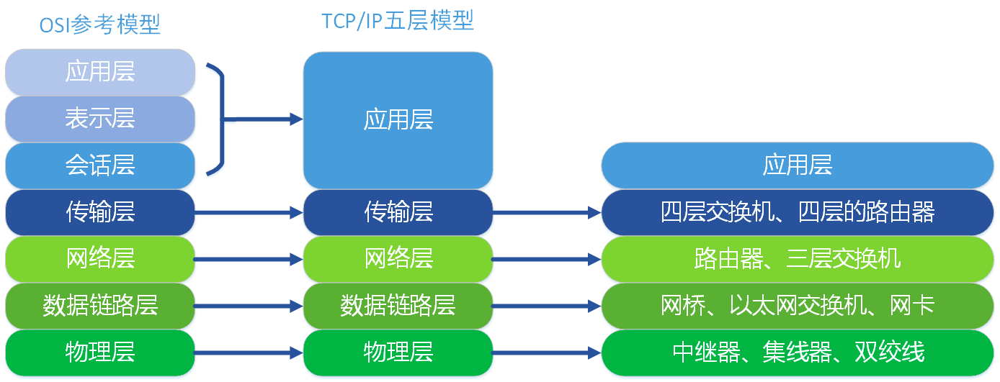
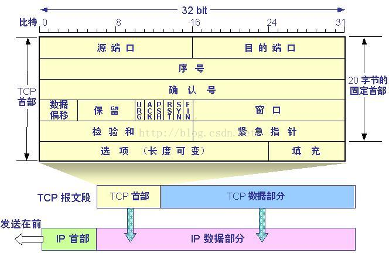
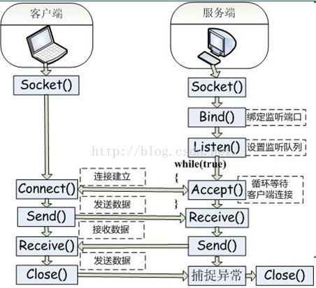

# Computer Network

## OSI七层模型与TCP/IP五层模型

### 应用层

OSI参考模型中最靠近用户的一层，是为计算机用户提供应用接口，也为用户直接提供各种网络服务。

商业报价单，就是应用层提供的一种网络服务，当然，也可以选择其他服务，比如说，发一份商业合同，发一份询价单等等。

#### 常用应用层协议

| 协议名 | 协议用途 |
| ---- | ---- |
| HTTP | 缺省TCP80端口 |
| HTTPS | 缺省TCP443端口，在普通的HTTP与TCP层之间多了一个安全加密的夹层，称之为SSL |
| DNS |用于解析域名与IP地址的基于UDP/TCP 应用层协议 |
| DHCP | 用于主机动态获取IP地址、缺省网关、DNS服务器等参数的基于UDP 应用层协议 |
| NFS | 用于Unix / Linux 文件共享，基于UDP/TCP协议 |
| NTP | 用于时钟同步的基于UDP的应用层协议 |
| SMTP | 用于邮件发送的基于TCP的应用层协议 |
| POP3 | 用于邮件接收的基于TCP的应用层协议 |
| FTP -> SFTP | 文件传输协议，SFTP协议是在FTP的基础上对数据进行加密，SFTP是SSH（缺省端口22）的一部分 |
| TELNET -> SSH | telnet 是明码传输的，发送的数据被监听后不需要解密就能看到内容；ssh 是加密的，基于 SSL |

### 表示层

表示层提供各种用于应用层数据的编码和转换功能,确保一个系统的应用层发送的数据能被另一个系统的应用层识别。如果必要，该层可提供一种标准表示形式，用于将计算机内部的多种数据格式转换成通信中采用的标准表示形式。数据压缩和加密也是表示层可提供的转换功能之一。

由于公司A和公司B是不同国家的公司，他们之间的商定统一用英语作为交流的语言，所以此时表示层（公司的文秘），就是将应用层的传递信息转翻译成英语。同时为了防止别的公司看到，公司A的人也会对这份报价单做一些加密的处理。这就是表示的作用，将应用层的数据转换翻译等。

### 会话层

会话层就是负责建立、管理和终止表示层实体之间的通信会话。该层的通信由不同设备中的应用程序之间的服务请求和响应组成。

会话层的同事拿到表示层的同事转换后资料，（会话层的同事类似公司的外联部），会话层的同事那里可能会掌握本公司与其他好多公司的联系方式，这里公司就是实际传递过程中的实体。他们要管理本公司与外界好多公司的联系会话。当接收到表示层的数据后，会话层将会建立并记录本次会话，他首先要找到公司B的地址信息，然后将整份资料放进信封，并写上地址和联系方式。准备将资料寄出。等到确定公司B接收到此份报价单后，此次会话就算结束了，外联部的同事就会终止此次会话。

### 传输层

传输层建立了主机端到端的链接，传输层的作用是为上层协议提供端到端的可靠和透明的数据传输服务，包括处理差错控制和流量控制等问题。该层向高层屏蔽了下层数据通信的细节，使高层用户看到的只是在两个传输实体间的一条主机到主机的、可由用户控制和设定的、可靠的数据通路。我们通常说的，TCP UDP就是在这一层。端口号既是这里的"端"。

传输层就相当于公司中的负责快递邮件收发的人，公司自己的投递员，他们负责将上一层的要寄出的资料投递到快递公司或邮局。

| 协议名 | 协议用途 |
| ---- | ---- |
| TCP | 面向连接，三次握手 |
| UDP | 无连接 |

### 网络层

本层通过IP寻址来建立两个节点之间的连接，为源端的运输层送来的分组，选择合适的路由和交换节点，正确无误地按照地址传送给目的端的运输层。就是通常说的IP层。这一层就是我们经常说的IP协议层。IP协议是Internet的基础。

网络层就相当于快递公司庞大的快递网络，全国不同的集散中心，比如说，从深圳发往北京的顺丰快递（陆运为例啊，空运好像直接就飞到北京了），首先要到顺丰的深圳集散中心，从深圳集散中心再送到武汉集散中心，从武汉集散中心再寄到北京顺义集散中心。这个每个集散中心，就相当于网络中的一个IP节点。

| 协议名 | 协议用途 |
| ---- | ---- |
| IP | 负责分配IP地址，提供路由 |
| ARP | 地址解析协议，将IP地址转换为物理地址 |
| ICMP | 为了提高IP数据报成功交付的机会，在IP数据报传输的过程中进行差错报告和查询，比如目的主机或网络不可到达，报文被丢弃，路由阻塞，查询目的网络是否可以到达等等 |

注： ping是应用层直接使用网络层ICMP的一个特例，它没有通过运输层的TCP或UDP

### 数据链路层

将比特组合成字节,再将字节组合成帧,使用链路层地址 (以太网使用MAC地址)来访问介质,并进行差错检测。

数据链路层又分为2个子层：逻辑链路控制子层（LLC）和媒体访问控制子层（MAC）。MAC子层处理CSMA/CD算法、数据出错校验、成帧等；LLC子层定义了一些字段使上次协议能共享数据链路层。
*在实际使用中，LLC子层并非必需的。*

### 物理层

实际最终信号的传输是通过物理层实现的。通过物理介质传输比特流。规定了电平、速度和电缆针脚。常用设备有（各种物理设备）集线器、中继器、调制解调器、网线、双绞线、同轴电缆。这些都是物理层的传输介质。

快递寄送过程中的交通工具，就相当于我们的物理层，例如汽车，火车，飞机，船。

## TCP协议和UDP协议

| 类型 | 协议名 |
| ---- | ---- |
| TCP | FTP Telnet SMTP HTTP POP3 DNS |
| UDP | TFTP SNMP DHCP DNS |

### TCP协议

TCP提供一种面向连接的、可靠的字节流服务。 其主要特性有特性有以下几点：

面向连接，在数据传送前必须建立连接，在数据传送结束后必须释放连接。意味着两个使用TCP的应用（通常是一个客户和一个服务器）在彼此交换数据之前必须先建立一个TCP连接。在一个TCP连接中，仅有两方进行彼此通信。广播和多播不能用于TCP。

点对点，每一条TCP连接只能有两个端点。从socket角度来说，通信双方需要建立套接字，套接字由IP地址和端口号组成，数据到达传输层之后会被送到端口对应的应用程序。

提供可靠交付服务。可靠交付后续讨论。

支持全双工。数据在两个方向上流动。

面向字节流。面向报文的传输方式是应用层交给UDP多长的报文，UDP就照样发送，即一次发送一个报文。因此，应用程序必须选择合适大小的报文。若报文太长，则IP层需要分片，降低效率。若太短，会是IP太小。UDP对应用层交下来的报文，既不合并，也不拆分，而是保留这些报文的边界。这也就是说，应用层交给UDP多长的报文，UDP就照样发送，即一次发送一个报文。面向字节流的话，虽然应用程序和TCP的交互是一次一个数据块(大小不等)，但TCP把应用程序数据看成是一连串的无结构的字节流。TCP有一个缓冲，当应用程序传送的数据块太长，TCP就可以把它划分短一些再传送。如果应用程序一次只发送一个字节，TCP也可以等待积累有足够多的字节后再构成报文段发送出去。

#### TCP如何保证可靠传输，拥塞控制过程

应用数据被分割成TCP认为最适合发送的数据块。TCP在三次握手建立连接过程中，会在SYN报文中使用MSS（Maximum Segment Size）选项功能，协商交互双方能够接收的最大段长MSS值。MSS是传输层TCP协议范畴内的概念，顾名思义，其标识TCP能够承载的最大的应用数据段长度，因此，MSS=MTU-20字节TCP报头-20字节IP报头，那么在以太网环境下，MSS值一般就是1500-20-20=1460字节。但是如果主机没有填写这一项，该值的默认大小为536字节。客户端与服务器端分别根据自己发包接口的MTU值计算出相应MSS值，并通过SYN报文告知对方.MSS是控制TCP报文段的大小，发送窗口(TCP中发送方可发送的最大数据)的大小由窗口值和拥塞窗口值共同确定；

TCP将保持它首部和数据的检验和。这是一个端到端的检验和，目的是检测数据在传输过程中的任何变化。如果收到段的检验和有差错，TCP将丢弃这个报文段和不确认收到此报文段。 (校验出包有错，丢弃报文段，不给出响应，TCP发送数据端，超时时会重发数据)。

超时重传机制：当TCP发出一个数据后，它启动一个定时器，等待目的端确认收到这个报文段。如果不能及时收到一个确认，将重发这个报文段。在未收到确认之前，这些已经发送的数据报将留在发送缓冲区，直到收到确认之后才清除已发送的数据。

既然TCP报文段作为IP数据报来传输，而IP数据报的到达可能会失序，因此TCP报文段的到达也可能会失序。如果必要，TCP将对收到的数据进行重新排序，将收到的数据以正确的顺序交给应用层。(对失序数据进行重新排序，然后才交给应用层).如果TCP的接收端必须丢弃重复的数据。(对于重复数据，能够丢弃重复数据。)

TCP还能提供流量控制。TCP连接的每一方都有固定大小的缓冲空间。TCP的接收端只允许另一端发送接收端缓冲区所能接纳的数据。这将防止较快主机致使较慢主机的缓冲区溢出。(TCP可以进行流量控制，防止较快主机致使较慢主机的缓冲区溢出)。一旦有一方来不及接受数据，势必会造成数据的丢失！！

以字节为单位的滑动窗口

滑动窗口协议：是TCP使用的一种流量控制方法。该协议允许发送方在停止并等待确认前可以连续发送多个分组。由于发送方不必每发一个分组就停下来等待确认，因此该协议可以加速数据的传输。TCP中采用滑动窗口来进行传输控制，滑动窗口的大小意味着接收方还有多大的缓冲区可以用于接收数据。发送方可以通过滑动窗口的大小来确定应该发送多少字节的数据。当滑动窗口为0时，发送方一般不能再发送数据报。
发送窗口和接收窗口：在数据发送方维持的滑动窗口(个人觉得滑动窗口不应该从窗口的角度去理解，应该从滑动窗口协议也就是一种维持双方数据传传送的机制，也就是从动态的角度去理解滑动窗口)的大小(p3-p1)就是发送窗口，同时在接受方维持的滑动窗口叫接受窗口；发送方的发送窗口一定不能超过接收方的接收窗口；

TCP收发过程：

(1)客户端和服务器端各自建立套接字，通过彼此的套接字进行通信；
(2)服务器端绑定监听端口，然后监听，循环等待来自客户端的连接；
(3)一旦收到来自客户端的连接，进行三次握手，一旦连成功就fork()一个子进程来处理和当前客户端的连接，然后父进程继续监听客户端的连接；
(4)此后就是数据传输过程(如上图所示)；
(5)一旦数据传输完毕就是放连接；

选择确认ACK。选择确认是针对没有出错但是未按序到达的报文段，如果中间只是缺少一些报文段，那么发送方就可以不重传已发送的所有数据，而只是重传缺少的数据。

__拥塞控制__

拥塞窗口：指源端在拥塞情况下一次性发送的最大报文段的数量。在刚开始的时候，双方不知道网络的通信状况，在一开始的时候将拥塞窗口值设置为１个报文段(此时数据发送方的发送窗口刚好等于１个报文段)，每收到一个ACK， 拥塞窗口就增加一个报文段（cwnd以字节为单位，但是慢启动以报文段大小为单位进行增加）。发送方取拥塞窗口与通告窗口中的最小值作为发送上限。拥塞窗 口是发送方使用的流量控制，而通告窗口则是接收方使用的流量控制。发送方开始时发送一个报文段，然后等待ACK。当收到该ACK时，拥塞窗口从1增加为2，即可以发送两个报文段。当收到这两个报文段的ACK时，拥塞窗口就增加为4。这是一种指数增加的关系。因为数据发送方一开始并不知道拥塞窗口的大小，所以刚开始以指数的方式探测，当达到一个门限值时，便线性增长。

慢开始和拥塞避免：发送方维持一个叫做拥塞窗口cwnd（congestion window）的状态变量。拥塞窗口的大小取决于网络的拥塞程度，并且动态地在变化。发送方让自己的发送窗口等于拥塞窗口，另外考虑到接受方的接收能力，发送窗口可能小于拥塞窗口。慢开始算法的思路就是，不要一开始就发送大量的数据，先探测一下网络的拥塞程度，也就是说由小到大逐渐增加拥塞窗口的大小。为了防止cwnd增长过大引起网络拥塞，还需设置一个慢开始门限ssthresh状态变量。ssthresh的用法如下：
当cwnd<ssthresh时，使用慢开始算法。
当cwnd>ssthresh时，改用拥塞避免算法。
当cwnd=ssthresh时，慢开始与拥塞避免算法任意。
拥塞避免算法让拥塞窗口缓慢增长，即每经过一个往返时间RTT就把发送方的拥塞窗口cwnd加1，而不是加倍。这样拥塞窗口按线性规律缓慢增长。无论是在慢开始阶段还是在拥塞避免阶段，只要发送方判断网络出现拥塞（其根据就是没有收到确认，虽然没有收到确认可能是其他原因的分组丢失，但是因为无法判定，所以都当做拥塞来处理），就把慢开始门限设置为出现拥塞时的发送窗口大小的一半。然后把拥塞窗口设置为1，执行慢开始算法。

快速重传和快速恢复

https://blog.csdn.net/caoyan_12727/article/details/52081329

#### TCP为什么三次握手

#### TCP问什么四次挥手

### UDP协议

### 综合

##  HTTP

###  HTTP1.0、1.1、2.0之间的区别

###  HTTP与HTTPS之间的区别，HTTPS链接建立的过程

###  对称加密算法和非对称加密算法

###  HTTP请求种类

###  HTTP常见响应状态码

###  重定向和转发

###  cookie和session