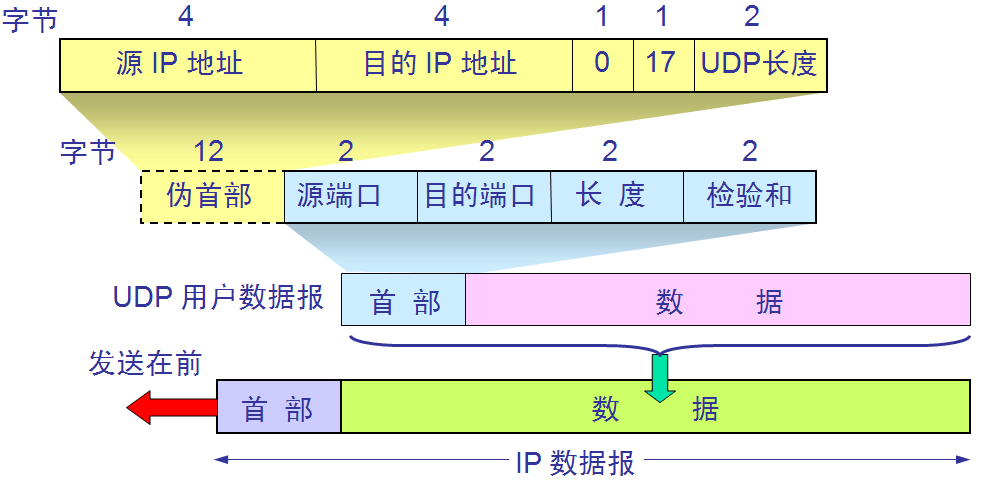

# Computer Network

## OSI七层模型与TCP/IP五层模型

### 应用层

OSI参考模型中最靠近用户的一层，是为计算机用户提供应用接口，也为用户直接提供各种网络服务。

商业报价单，就是应用层提供的一种网络服务，当然，也可以选择其他服务，比如说，发一份商业合同，发一份询价单等等。

#### 常用应用层协议

| 协议名 | 协议用途 |
| ---- | ---- |
| HTTP | 缺省TCP80端口 |
| HTTPS | 缺省TCP443端口，在普通的HTTP与TCP层之间多了一个安全加密的夹层，称之为SSL |
| DNS |用于解析域名与IP地址的基于UDP/TCP 应用层协议 |
| DHCP | 用于主机动态获取IP地址、缺省网关、DNS服务器等参数的基于UDP 应用层协议 |
| NFS | 用于Unix / Linux 文件共享，基于UDP/TCP协议 |
| NTP | 用于时钟同步的基于UDP的应用层协议 |
| SMTP | 用于邮件发送的基于TCP的应用层协议 |
| POP3 | 用于邮件接收的基于TCP的应用层协议 |
| FTP -> SFTP | 文件传输协议，SFTP协议是在FTP的基础上对数据进行加密，SFTP是SSH（缺省端口22）的一部分 |
| TELNET -> SSH | telnet 是明码传输的，发送的数据被监听后不需要解密就能看到内容；ssh 是加密的，基于 SSL |

### 表示层

表示层提供各种用于应用层数据的编码和转换功能,确保一个系统的应用层发送的数据能被另一个系统的应用层识别。如果必要，该层可提供一种标准表示形式，用于将计算机内部的多种数据格式转换成通信中采用的标准表示形式。数据压缩和加密也是表示层可提供的转换功能之一。

由于公司A和公司B是不同国家的公司，他们之间的商定统一用英语作为交流的语言，所以此时表示层（公司的文秘），就是将应用层的传递信息转翻译成英语。同时为了防止别的公司看到，公司A的人也会对这份报价单做一些加密的处理。这就是表示的作用，将应用层的数据转换翻译等。

### 会话层

会话层就是负责建立、管理和终止表示层实体之间的通信会话。该层的通信由不同设备中的应用程序之间的服务请求和响应组成。

会话层的同事拿到表示层的同事转换后资料，（会话层的同事类似公司的外联部），会话层的同事那里可能会掌握本公司与其他好多公司的联系方式，这里公司就是实际传递过程中的实体。他们要管理本公司与外界好多公司的联系会话。当接收到表示层的数据后，会话层将会建立并记录本次会话，他首先要找到公司B的地址信息，然后将整份资料放进信封，并写上地址和联系方式。准备将资料寄出。等到确定公司B接收到此份报价单后，此次会话就算结束了，外联部的同事就会终止此次会话。

### 传输层

传输层建立了主机端到端的链接，传输层的作用是为上层协议提供端到端的可靠和透明的数据传输服务，包括处理差错控制和流量控制等问题。该层向高层屏蔽了下层数据通信的细节，使高层用户看到的只是在两个传输实体间的一条主机到主机的、可由用户控制和设定的、可靠的数据通路。我们通常说的，TCP UDP就是在这一层。端口号既是这里的"端"。

传输层就相当于公司中的负责快递邮件收发的人，公司自己的投递员，他们负责将上一层的要寄出的资料投递到快递公司或邮局。

| 协议名 | 协议用途 |
| ---- | ---- |
| TCP | 面向连接，三次握手 |
| UDP | 无连接 |

### 网络层

本层通过IP寻址来建立两个节点之间的连接，为源端的运输层送来的分组，选择合适的路由和交换节点，正确无误地按照地址传送给目的端的运输层。就是通常说的IP层。这一层就是我们经常说的IP协议层。IP协议是Internet的基础。

网络层就相当于快递公司庞大的快递网络，全国不同的集散中心，比如说，从深圳发往北京的顺丰快递（陆运为例啊，空运好像直接就飞到北京了），首先要到顺丰的深圳集散中心，从深圳集散中心再送到武汉集散中心，从武汉集散中心再寄到北京顺义集散中心。这个每个集散中心，就相当于网络中的一个IP节点。

| 协议名 | 协议用途 |
| ---- | ---- |
| IP | 负责分配IP地址，提供路由 |
| ARP | 地址解析协议，将IP地址转换为物理地址 |
| ICMP | 为了提高IP数据报成功交付的机会，在IP数据报传输的过程中进行差错报告和查询，比如目的主机或网络不可到达，报文被丢弃，路由阻塞，查询目的网络是否可以到达等等 |

注： ping是应用层直接使用网络层ICMP的一个特例，它没有通过运输层的TCP或UDP

### 数据链路层

将比特组合成字节,再将字节组合成帧,使用链路层地址 (以太网使用MAC地址)来访问介质,并进行差错检测。

数据链路层又分为2个子层：逻辑链路控制子层（LLC）和媒体访问控制子层（MAC）。MAC子层处理CSMA/CD算法、数据出错校验、成帧等；LLC子层定义了一些字段使上次协议能共享数据链路层。
*在实际使用中，LLC子层并非必需的。*

### 物理层

实际最终信号的传输是通过物理层实现的。通过物理介质传输比特流。规定了电平、速度和电缆针脚。常用设备有（各种物理设备）集线器、中继器、调制解调器、网线、双绞线、同轴电缆。这些都是物理层的传输介质。

快递寄送过程中的交通工具，就相当于我们的物理层，例如汽车，火车，飞机，船。

## TCP协议和UDP协议

| 类型 | 协议名 |
| ---- | ---- |
| TCP | FTP Telnet SMTP HTTP POP3 DNS |
| UDP | TFTP SNMP DHCP DNS |

### TCP协议

TCP提供一种面向连接的、可靠的字节流服务。 其主要特性有特性有以下几点：

面向连接，在数据传送前必须建立连接，在数据传送结束后必须释放连接。意味着两个使用TCP的应用（通常是一个客户和一个服务器）在彼此交换数据之前必须先建立一个TCP连接。在一个TCP连接中，仅有两方进行彼此通信。广播和多播不能用于TCP。

点对点，每一条TCP连接只能有两个端点。从socket角度来说，通信双方需要建立套接字，套接字由IP地址和端口号组成，数据到达传输层之后会被送到端口对应的应用程序。

提供可靠交付服务。可靠交付后续讨论。

支持全双工。数据在两个方向上流动。

面向字节流。面向报文的传输方式是应用层交给UDP多长的报文，UDP就照样发送，即一次发送一个报文。因此，应用程序必须选择合适大小的报文。若报文太长，则IP层需要分片，降低效率。若太短，会是IP太小。UDP对应用层交下来的报文，既不合并，也不拆分，而是保留这些报文的边界。这也就是说，应用层交给UDP多长的报文，UDP就照样发送，即一次发送一个报文。面向字节流的话，虽然应用程序和TCP的交互是一次一个数据块(大小不等)，但TCP把应用程序数据看成是一连串的无结构的字节流。TCP有一个缓冲，当应用程序传送的数据块太长，TCP就可以把它划分短一些再传送。如果应用程序一次只发送一个字节，TCP也可以等待积累有足够多的字节后再构成报文段发送出去。

#### TCP如何保证可靠传输，拥塞控制过程

应用数据被分割成TCP认为最适合发送的数据块。TCP在三次握手建立连接过程中，会在SYN报文中使用MSS（Maximum Segment Size）选项功能，协商交互双方能够接收的最大段长MSS值。MSS是传输层TCP协议范畴内的概念，顾名思义，其标识TCP能够承载的最大的应用数据段长度，因此，MSS=MTU-20字节TCP报头-20字节IP报头，那么在以太网环境下，MSS值一般就是1500-20-20=1460字节。但是如果主机没有填写这一项，该值的默认大小为536字节。客户端与服务器端分别根据自己发包接口的MTU值计算出相应MSS值，并通过SYN报文告知对方.MSS是控制TCP报文段的大小，发送窗口(TCP中发送方可发送的最大数据)的大小由窗口值和拥塞窗口值共同确定；

TCP将保持它首部和数据的检验和。这是一个端到端的检验和，目的是检测数据在传输过程中的任何变化。如果收到段的检验和有差错，TCP将丢弃这个报文段和不确认收到此报文段。 (校验出包有错，丢弃报文段，不给出响应，TCP发送数据端，超时时会重发数据)。

超时重传机制：当TCP发出一个数据后，它启动一个定时器，等待目的端确认收到这个报文段。如果不能及时收到一个确认，将重发这个报文段。在未收到确认之前，这些已经发送的数据报将留在发送缓冲区，直到收到确认之后才清除已发送的数据。

既然TCP报文段作为IP数据报来传输，而IP数据报的到达可能会失序，因此TCP报文段的到达也可能会失序。如果必要，TCP将对收到的数据进行重新排序，将收到的数据以正确的顺序交给应用层。(对失序数据进行重新排序，然后才交给应用层).如果TCP的接收端必须丢弃重复的数据。(对于重复数据，能够丢弃重复数据。)

TCP还能提供流量控制。TCP连接的每一方都有固定大小的缓冲空间。TCP的接收端只允许另一端发送接收端缓冲区所能接纳的数据。这将防止较快主机致使较慢主机的缓冲区溢出。(TCP可以进行流量控制，防止较快主机致使较慢主机的缓冲区溢出)。一旦有一方来不及接受数据，势必会造成数据的丢失！！

以字节为单位的滑动窗口

滑动窗口协议：是TCP使用的一种流量控制方法。该协议允许发送方在停止并等待确认前可以连续发送多个分组。由于发送方不必每发一个分组就停下来等待确认，因此该协议可以加速数据的传输。TCP中采用滑动窗口来进行传输控制，滑动窗口的大小意味着接收方还有多大的缓冲区可以用于接收数据。发送方可以通过滑动窗口的大小来确定应该发送多少字节的数据。当滑动窗口为0时，发送方一般不能再发送数据报。
发送窗口和接收窗口：在数据发送方维持的滑动窗口(个人觉得滑动窗口不应该从窗口的角度去理解，应该从滑动窗口协议也就是一种维持双方数据传传送的机制，也就是从动态的角度去理解滑动窗口)的大小(p3-p1)就是发送窗口，同时在接受方维持的滑动窗口叫接受窗口；发送方的发送窗口一定不能超过接收方的接收窗口；

TCP收发过程：

(1)客户端和服务器端各自建立套接字，通过彼此的套接字进行通信；
(2)服务器端绑定监听端口，然后监听，循环等待来自客户端的连接；
(3)一旦收到来自客户端的连接，进行三次握手，一旦连成功就fork()一个子进程来处理和当前客户端的连接，然后父进程继续监听客户端的连接；
(4)此后就是数据传输过程(如上图所示)；
(5)一旦数据传输完毕就是放连接；

选择确认ACK。选择确认是针对没有出错但是未按序到达的报文段，如果中间只是缺少一些报文段，那么发送方就可以不重传已发送的所有数据，而只是重传缺少的数据。

__拥塞控制__

拥塞窗口：指源端在拥塞情况下一次性发送的最大报文段的数量。在刚开始的时候，双方不知道网络的通信状况，在一开始的时候将拥塞窗口值设置为１个报文段(此时数据发送方的发送窗口刚好等于１个报文段)，每收到一个ACK， 拥塞窗口就增加一个报文段（cwnd以字节为单位，但是慢启动以报文段大小为单位进行增加）。发送方取拥塞窗口与通告窗口中的最小值作为发送上限。拥塞窗 口是发送方使用的流量控制，而通告窗口则是接收方使用的流量控制。发送方开始时发送一个报文段，然后等待ACK。当收到该ACK时，拥塞窗口从1增加为2，即可以发送两个报文段。当收到这两个报文段的ACK时，拥塞窗口就增加为4。这是一种指数增加的关系。因为数据发送方一开始并不知道拥塞窗口的大小，所以刚开始以指数的方式探测，当达到一个门限值时，便线性增长。

慢开始和拥塞避免：发送方维持一个叫做拥塞窗口cwnd（congestion window）的状态变量。拥塞窗口的大小取决于网络的拥塞程度，并且动态地在变化。发送方让自己的发送窗口等于拥塞窗口，另外考虑到接受方的接收能力，发送窗口可能小于拥塞窗口。慢开始算法的思路就是，不要一开始就发送大量的数据，先探测一下网络的拥塞程度，也就是说由小到大逐渐增加拥塞窗口的大小。为了防止cwnd增长过大引起网络拥塞，还需设置一个慢开始门限ssthresh状态变量。ssthresh的用法如下：

    当cwnd<ssthresh时，使用慢开始算法。
    当cwnd>ssthresh时，改用拥塞避免算法。
    当cwnd=ssthresh时，慢开始与拥塞避免算法任意。

拥塞避免算法让拥塞窗口缓慢增长，即每经过一个往返时间RTT就把发送方的拥塞窗口cwnd加1，而不是加倍。这样拥塞窗口按线性规律缓慢增长。无论是在慢开始阶段还是在拥塞避免阶段，只要发送方判断网络出现拥塞（其根据就是没有收到确认，虽然没有收到确认可能是其他原因的分组丢失，但是因为无法判定，所以都当做拥塞来处理），就把慢开始门限设置为出现拥塞时的发送窗口大小的一半。然后把拥塞窗口设置为1，执行慢开始算法。

__快速重传 快速恢复__

假设现在网络没有发生拥塞，但是发送方发送的个别数据包却在网络中某一处丢失了，而此时发送方的超时计时器超时了，又没有收到确认，在这种情况，tcp拥塞控制会误认为出现网络拥塞，然后马上把拥塞窗口cwnd减小到1（即一个mss），并启动慢开始算法，同时把门限值ssthresh减半，这样就降低了通信效率，所以基于这种情况就有了快重传和快恢复两个算法。

快重传算法首先要求接收方每收到一个失序的分组后就立即发出重复确认，这么做的原因是让发送方及时知道有个别报文分组丢失了，没有到达对方。如图1中，发送方发送了M1和M2分组，分别都收到了确认，现在假设发送方发送的M3在网络中丢失了，接收方没有收到M3但是却收到了M4（注意：此时M4是一个失序分组）。

按照快重传算法规定：接收方收到失序的M4分组后，应该立即对M2发出重复确认（总共发送三次重复确认），也就是告诉发送方：“我还没收到M3分组”。

然后发送方又接着发送了M5，M6，接收方收到后就会继续发送重复确认M2。这样发送方收到了接收方三个重复的M2确认。快重传算法规定，只要发送方一连收到了3个重复确认就应该立即重传对方尚未收到的M3，而不是等待超时计时器超时后再进行重传，这样发送方及时重传了丢失的分组，因此快重传算法提高了通信效率。

配合快重传算法使用的还有快恢复算法，快恢复算法是这样规定：当发送方连续收到三个重复确认时，就执行“乘法减小”算法，把慢开始的门限值ssthresh减半，这只是发送方提前预防网络拥塞的措施。由于现在发送方认为没有发生网络拥塞（因为发送方连续收到了接收方发送的三个重复的确认，因此认为现在可能没有发生网络拥塞），但此时并不会执行慢开始算法，而是执行拥塞避免中的加法增大算法，使拥塞窗口缓慢增大，如图所示，重点关注红色部分。

在使用了快恢复算法后，慢开始算法就只会在建立tcp连接和出现超时的时候才会执行，换句话说，采用这种拥塞控制方法改进了tcp通信效率。

https://blog.csdn.net/caoyan_12727/article/details/52081329

#### TCP为什么三次握手

假设改为两次握手，client端发送的一个连接请求在服务器滞留了，这个连接请求是无效的，client已经是closed的状态了，而服务器认为client想要建立一个新的连接，于是向client发送确认报文段，而client端是closed状态，无论收到什么报文都会丢弃。而如果是两次握手的话，此时就已经建立连接了。服务器此时会一直等到client端发来数据，这样就浪费掉很多server端的资源。

但是如果服务器发送对这个延误的旧连接报文的确认的同时，客户端调用connect函数发起了连接，就会使客户端进入SYN_SEND状态，当服务器那个对延误旧连接报文的确认传到客户端时，因为客户端已经处于SYN_SEND状态，所以就会使客户端进入ESTABLISHED状态，此时服务器端反而丢弃了这个重复的通过connect函数发送的SYN包。而连接建立之后，发送包由于SEQ是以被丢弃的SYN包的序号为准，而服务器接收序号是以那个延误旧连接SYN报文序号为准，导致服务器丢弃后续发送的数据包。

#### TCP为什么四次挥手

    A:“喂，我不说了 (FIN)。” A->FIN_WAIT1
    B:“我知道了(ACK)。等下，上一句还没说完。Balabala…..（传输数据）” B->CLOSE_WAIT | A->FIN_WAIT2
    B:“好了，说完了，我也不说了（FIN）。” B->LAST_ACK
    A:“我知道了（ACK）。” A->TIME_WAIT | B->CLOSED
    A等待2MSL,保证B收到了消息,否则重说一次”我知道了”,A->CLOSED

防止客户端最后一次发给服务器的确认在网络中丢失以至于客户端关闭，而服务端并未关闭，导致资源的浪费。

__等待最大的2msl__ 可以让本次连接的所有的网络包在链路上消失，以防造成不必要的干扰。如果client直接closed，然后又向server发起了一个新连接，我们不能保证这个新连接和刚关闭的连接的端口号是不同的。假设新连接和已经关闭的老端口号是一样的，如果前一次滞留的某些数据仍然在网络中，这些延迟数据会在新连接建立后到达Server，所以socket就认为那个延迟的数据是属于新连接的，数据包就会发生混淆。所以client要在TIME_WAIT状态等待2倍的MSL，这样保证本次连接的所有数据都从网络中消失。

### UDP协议

端口号：

​用来表示发送和接受进程。由于IP层已经把IP数据报分配给TCP或UDP（根据IP首部中协议字段值），因此TCP端口号由TCP来查看，而UDP端口号由UDP来查看。TCP端口号与UDP端口号是相互独立的。

​长度：

​UDP长度字段指的是UDP首部和UDP数据的字节长度。该字段的最小值为 8 字节（发送一份0字节的UDP数据报是 O K）。

​检验和：

​UDP检验和是一个端到端的检验和。它由发送端计算，然后由接收端验证。其目的是为了发现UDP首部和数据在发送端到接收端之间发生的任何改动。

### IP协议

4位版本：

​目前协议版本号是4，因此IP有时也称作IPV4.

​4位首部长度：

​首部长度指的是首部占32bit字的数目，包括任何选项。由于它是一个4比特字段，因此首部长度最长为60个字节。

​服务类型（TOS）：

​服务类型字段包括一个3bit的优先权字段（现在已经被忽略），4bit的TOS子字段和1bit未用位必须置0。4bit的TOS分别代表：最小时延，最大吞吐量，最高可靠性和最小费用。4bit中只能置其中1比特。如果所有4bit均为0，那么就意味着是一般服务。

​总长度：

​总长度字段是指整个IP数据报的长度，以字节为单位。利用首部长度和总长度字段，就可以知道IP数据报中数据内容的起始位置和长度。由于该字段长16bit，所以IP数据报最长可达65535字节。当数据报被分片时，该字段的值也随着变化。

​标识字段：

​标识字段唯一地标识主机发送的每一份数据报。通常每发送一份报文它的值就会加1。

​生存时间：

​TTL（time-to-live）生存时间字段设置了数据报可以经过的最多路由器数。它指定了数据报的生存时间。TTL的初始值由源主机设置（通常为 3 2或6 4），一旦经过一个处理它的路由器，它的值就减去 1。当该字段的值为 0时，数据报就被丢弃，并发送 ICMP 报文通知源主机。

​首部检验和：

​首部检验和字段是根据 I P首部计算的检验和码。它不对首部后面的数据进行计算。 ICMP、IGMP、UDP和TCP在它们各自的首部中均含有同时覆盖首部和数据检验和码。

### 综合

##  HTTP

HTTP（超文本传输协议，HyperText Transfer Protocol)是互联网上应用最为广泛的一种网络协议。所有的WWW文件都必须遵守这个标准。设计HTTP最初的目的是为了提供一种发布和接收HTML页面的方法。是用于从WWW服务器传输超文本到本地浏览器的传输协议。默认使用80端口，HTTP客户端发起一个请求，建立一个到服务器指定端口（默认是80端口）的TCP连接。HTTP协议和TCP协议是不冲突的，HTTP定义在七层协议中的应用层，TCP解决的是传输层的逻辑。HTTP使用TCP而不是UDP的原因在于（打开）一个网页必须传送很多数据，而TCP协议提供传输控制，按顺序组织数据，和错误纠正。HTTP协议的瓶颈及其优化技巧都是基于TCP协议本身的特性。如TCP建立连接时三次握手有1.5个RTT（round-trip time）的延迟，为了避免每次请求的都经历握手带来的延迟，应用层会选择不同策略的http长链接方案。又如TCP在建立连接的初期有慢启动（slow start）的特性，所以连接的重用总是比新建连接性能要好。

HTTP连接使用的是“请求—响应”的方式，不仅在请求时需要先建立连接，而且需要客户端向服务器发出请求后，服务器端才能回复数据。HTTP/1.0是第一个在通讯中指定版本号的HTTP 协议版本，至今仍被广泛采用，特别是在代理服务器中。HTTP/1.1是当前版本，持久连接被默认采用，并能很好地配合代理服务器工作，还支持以管道方式同时发送多个请求，以便降低线路负载，提高传输速度。HTTP／2.0在HTTP 1.x的基础上，大幅度的提高了web性能，减少了网络延迟。HTTP1.0和1.1在之后很长的一段时间内会一直并存，这是由于网络基础设施更新缓慢所决定的。

__从输入网址到请求过程__
https://leetcode-cn.com/circle/article/T3jscW/

###  HTTP1.0、1.1、2.0之间的区别

#### HTTP 1.0

HTTP 协议老的标准是HTTP/1.0，为了提高系统的效率，HTTP 1.0规定浏览器与服务器只保持短暂的连接，浏览器的每次请求都需要与服务器建立一个TCP连接，服务器完成请求处理后立即断开TCP连接，服务器不跟踪每个客户也不记录过去的请求。但是，这也造成了一些性能上的缺陷，例如，一个包含有许多图像的网页文件中并没有包含真正的图像数据内容，而只是指明了这些图像的URL地址，当WEB浏览器访问这个网页文件时，浏览器首先要发出针对该网页文件的请求，当浏览器解析WEB服务器返回的该网页文档中的HTML内容时，发现其中的图像标签后，浏览器将根据标签中的src属性所指定的URL地址再次向服务器发出下载图像数据的请求。显 然，访问一个包含有许多图像的网页文件的整个过程包含了多次请求和响应，每次请求和响应都需要建立一个单独的连接，每次连接只是传输一个文档和图像，上一次和下一次请求完全分离。即使图像文件都很小，但是客户端和服务器端每次建立和关闭连接却是一个相对比较费时的过程，并且会严重影响客户机和服务器的性能。当一个网页文件中包含JavaScript文件，CSS文件等内容时，也会出现类似上述的情况。

同时，带宽和延迟也是影响一个网络请求的重要因素。在网络基础建设已经使得带宽得到极大的提升的当下，大部分时候都是延迟在于响应速度。基于此会发现，http1.0被抱怨最多的就是连接无法复用，和head of line blocking这两个问题。理解这两个问题有一个十分重要的前提：客户端是依据域名来向服务器建立连接，一般PC端浏览器会针对单个域名的server同时建立6～8个连接，手机端的连接数则一般控制在4～6个。显然连接数并不是越多越好，资源开销和整体延迟都会随之增大。连接无法复用会导致每次请求都经历三次握手和慢启动。三次握手在高延迟的场景下影响较明显，慢启动则对文件类大请求影响较大。head of line blocking会导致带宽无法被充分利用，以及后续健康请求被阻塞。

head of line blocking(holb)会导致健康的请求会被不健康的请求影响，而且这种体验的损耗受网络环境影响，出现随机且难以监控。为了解决holb带来的延迟，协议设计者设计了一种新的pipelining机制。pipelining只能适用于http1.1,而且由于使用苛刻，很多浏览器厂商并不支持。

#### HTTP 1.1

为了克服HTTP 1.0的这个缺陷，HTTP 1.1支持持久连接（HTTP/1.1的默认模式使用带流水线的持久连接），在一个TCP连接上可以传送多个HTTP请求和响应，减少了建立和关闭连接的消耗和延迟。一个包含有许多图像的网页文件的多个请求和应答可以在一个连接中传输，但每个单独的网页文件的请求和应答仍然需要使用各自的连接。HTTP 1.1还允许客户端不用等待上一次请求结果返回，就可以发出下一次请求，但服务器端必须按照接收到客户端请求的先后顺序依次回送响应结果，以保证客户端能够区分出每次请求的响应内容，这样也显著地减少了整个下载过程所需要的时间。

在http1.1，request和reponse头中都有可能出现一个connection的头，此header的含义是当client和server通信时对于长链接如何进行处理。
在http1.1中，client和server都是默认对方支持长链接的， 如果client使用http1.1协议，但又不希望使用长链接，则需要在header中指明connection的值为close；如果server方也不想支持长链接，则在response中也需要明确说明connection的值为close。不论request还是response的header中包含了值为close的connection，都表明当前正在使用的tcp链接在当天请求处理完毕后会被断掉。以后client再进行新的请求时就必须创建新的tcp链接了。

HTTP 1.1在继承了HTTP 1.0优点的基础上，也克服了HTTP 1.0的性能问题。HTTP 1.1通过增加更多的请求头和响应头来改进和扩充HTTP 1.0的功能。如，HTTP 1.0不支持Host请求头字段，WEB浏览器无法使用主机头名来明确表示要访问服务器上的哪个WEB站点，这样就无法使用WEB服务器在同一个IP地址和端口号上配置多个虚拟WEB站点。在HTTP 1.1中增加Host请求头字段后，WEB浏览器可以使用主机头名来明确表示要访问服务器上的哪个WEB站点，这才实现了在一台WEB服务器上可以在同一个IP地址和端口号上使用不同的主机名来创建多个虚拟WEB站点。HTTP 1.1的持续连接，也需要增加新的请求头来帮助实现，例如，Connection请求头的值为Keep-Alive时，客户端通知服务器返回本次请求结果后保持连接；Connection请求头的值为close时，客户端通知服务器返回本次请求结果后关闭连接。HTTP 1.1还提供了与身份认证、状态管理和Cache缓存等机制相关的请求头和响应头。HTTP/1.0不支持文件断点续传，<code>RANGE:bytes</code>是HTTP/1.1新增内容，HTTP/1.0每次传送文件都是从文件头开始，即0字节处开始。<code>RANGE:bytes=XXXX</code>表示要求服务器从文件XXXX字节处开始传送，这就是我们平时所说的断点续传！

由上，HTTP/1.1相较于 HTTP/1.0 协议的区别主要体现在：

1 缓存处理

2 带宽优化及网络连接的使用

3 错误通知的管理

4 消息在网络中的发送

5 互联网地址的维护

6 安全性及完整性

#### HTTP 2.0

__多路复用 (Multiplexing)__

多路复用允许同时通过单一的 HTTP/2 连接发起多重的请求-响应消息。在 HTTP/1.1 协议中浏览器客户端在同一时间，针对同一域名下的请求有一定数量限制。超过限制数目的请求会被阻塞。这也是为何一些站点会有多个静态资源 CDN 域名的原因之一，拿 Twitter 为例，http://twimg.com，目的就是变相的解决浏览器针对同一域名的请求限制阻塞问题。而 HTTP/2 的多路复用(Multiplexing) 则允许同时通过单一的 HTTP/2 连接发起多重的请求-响应消息。因此 HTTP/2 可以很容易的去实现多流并行而不用依赖建立多个 TCP 连接，HTTP/2 把 HTTP 协议通信的基本单位缩小为一个一个的帧，这些帧对应着逻辑流中的消息。并行地在同一个 TCP 连接上双向交换消息。

__二进制分帧__

HTTP/2在 应用层(HTTP/2)和传输层(TCP or UDP)之间增加一个二进制分帧层。在不改动 HTTP/1.x 的语义、方法、状态码、URI 以及首部字段的情况下, 解决了HTTP1.1 的性能限制，改进传输性能，实现低延迟和高吞吐量。在二进制分帧层中， HTTP/2 会将所有传输的信息分割为更小的消息和帧（frame）,并对它们采用二进制格式的编码 ，其中 HTTP1.x 的首部信息会被封装到 HEADER frame，而相应的 Request Body 则封装到 DATA frame 里面。

HTTP/2 通信都在一个连接上完成，这个连接可以承载任意数量的双向数据流。在过去， HTTP 性能优化的关键并不在于高带宽，而是低延迟。TCP 连接会随着时间进行自我调谐，起初会限制连接的最大速度，如果数据成功传输，会随着时间的推移提高传输的速度。这种调谐则被称为 TCP 慢启动。由于这种原因，让原本就具有突发性和短时性的 HTTP 连接变的十分低效。HTTP/2 通过让所有数据流共用同一个连接，可以更有效地使用 TCP 连接，让高带宽也能真正的服务于 HTTP 的性能提升。

这种单连接多资源的方式，减少服务端的链接压力,内存占用更少,连接吞吐量更大；而且由于 TCP 连接的减少而使网络拥塞状况得以改善，同时慢启动时间的减少,使拥塞和丢包恢复速度更快。

__首部压缩（Header Compression）__

HTTP/1.1并不支持 HTTP 首部压缩，为此 SPDY 和 HTTP/2 应运而生， SPDY 使用的是通用的DEFLATE 算法，而 HTTP/2 则使用了专门为首部压缩而设计的 HPACK 算法。

__服务端推送（Server Push）__

服务端推送是一种在客户端请求之前发送数据的机制。在 HTTP/2 中，服务器可以对客户端的一个请求发送多个响应。Server Push 让 HTTP1.x 时代使用内嵌资源的优化手段变得没有意义；如果一个请求是由你的主页发起的，服务器很可能会响应主页内容、logo 以及样式表，因为它知道客户端会用到这些东西。这相当于在一个 HTML 文档内集合了所有的资源，不过与之相比，服务器推送还有一个很大的优势：可以缓存！也让在遵循同源的情况下，不同页面之间可以共享缓存资源成为可能。

###  HTTP与HTTPS之间的区别，HTTPS链接建立的过程

HTTP协议传输的数据都是未加密的，也就是明文的，因此使用HTTP协议传输隐私信息非常不安全。为了保证这些隐私数据能加密传输，于是网景公司设计了SSL（Secure Sockets Layer）协议用于对HTTP协议传输的数据进行加密，从而就诞生了HTTPS。现在的HTTPS都是用的TLS协议，但是由于SSL出现的时间比较早，并且依旧被现在浏览器所支持，因此SSL依然是HTTPS的代名词。

HTTPS在传输数据之前需要客户端（浏览器）与服务端（网站）之间进行一次握手，在握手过程中将确立双方加密传输数据的密码信息。TLS/SSL协议不仅仅是一套加密传输的协议，TLS/SSL中使用了非对称加密，对称加密以及HASH算法。握手过程的简单描述如下：

1.浏览器将自己支持的一套加密规则发送给网站。

2.网站从中选出一组加密算法与HASH算法，并将自己的身份信息以证书的形式发回给浏览器。证书里面包含了网站地址，加密公钥，以及证书的颁发机构等信息。

3.获得网站证书之后浏览器要做以下工作：
a) 验证证书的合法性（颁发证书的机构是否合法，证书中包含的网站地址是否与正在访问的地址一致等），如果证书受信任，则浏览器栏里面会显示一个小锁头，否则会给出证书不受信的提示。
b) 如果证书受信任，或者是用户接受了不受信的证书，浏览器会生成一串随机数的密码，并用证书中提供的公钥加密。
c) 使用约定好的HASH计算握手消息，并使用生成的随机数对消息进行加密，最后将之前生成的所有信息发送给网站。

4.网站接收浏览器发来的数据之后要做以下的操作：
a) 使用自己的私钥将信息解密取出密码，使用密码解密浏览器发来的握手消息，并验证HASH是否与浏览器发来的一致。
b) 使用密码加密一段握手消息，发送给浏览器。

5.浏览器解密并计算握手消息的HASH，如果与服务端发来的HASH一致，此时握手过程结束，之后所有的通信数据将由之前浏览器生成的随机密码并利用对称加密算法进行加密。

这里浏览器与网站互相发送加密的握手消息并验证，目的是为了保证双方都获得了一致的密码，并且可以正常的加密解密数据。其中非对称加密算法用于在握手过程中加密生成的密码，对称加密算法用于对真正传输的数据进行加密，而HASH算法用于验证数据的完整性。由于浏览器生成的密码是整个数据加密的关键，因此在传输的时候使用了非对称加密算法对其加密。非对称加密算法会生成公钥和私钥，公钥只能用于加密数据，因此可以随意传输，而网站的私钥用于对数据进行解密，所以网站都会非常小心的保管自己的私钥，防止泄漏。

TLS握手过程中如果有任何错误，都会使加密连接断开，从而阻止了隐私信息的传输。正是由于HTTPS非常的安全，攻击者无法从中找到下手的地方，于是更多的是采用了假证书的手法来欺骗客户端，从而获取明文的信息。默认HTTP的端口号为80，HTTPS的端口号为443。

###  对称加密算法和非对称加密算法

https://blog.csdn.net/liudongdong19/article/details/82217431

###  HTTP请求种类

GET 请求获取Request-URI所标识的资源

POST 在Request-URI所标识的资源后附加新的数据

HEAD 请求获取由Request-URI所标识的资源的响应消息报头

PUT 请求服务器存储一个资源，并用Request-URI作为其标识

DELETE 请求服务器删除Request-URI所标识的资源

TRACE 请求服务器回送收到的请求信息，主要用于测试或诊断

CONNECT 保留将来使用

OPTIONS 请求查询服务器的性能，或者查询与资源相关的选项和需求

GET方法：在浏览器的地址栏中输入网址的方式访问网页时，浏览器采用GET方法向服务器获取资源，POST方法要求被请求服务器接受附在请求后面的数据，常用于提交表单。GET是用于获取数据的，POST一般用于将数据发给服务器之用。

###  HTTP常见响应状态码

    100 Continue 初始的请求已经接受，客户应当继续发送请求的其余部分。（HTTP 1.1新）
    101 Switching Protocols 服务器将遵从客户的请求转换到另外一种协议（HTTP 1.1新）

    200 OK 一切正常，对GET和POST请求的应答文档跟在后面。
    201 Created 服务器已经创建了文档，Location头给出了它的URL。
    202 Accepted 已经接受请求，但处理尚未完成。
    203 Non-Authoritative Information 文档已经正常地返回，但一些应答头可能不正确，因为使用的是文档的拷贝（HTTP 1.1新）。
    204 No Content 没有新文档，浏览器应该继续显示原来的文档。如果用户定期地刷新页面，而Servlet可以确定用户文档足够新，这个状态代码是很有用的。
    205 Reset Content 没有新的内容，但浏览器应该重置它所显示的内容。用来强制浏览器清除表单输入内容（HTTP 1.1新）。
    206 Partial Content 客户发送了一个带有Range头的GET请求，服务器完成了它（HTTP 1.1新）。

    300 Multiple Choices 客户请求的文档可以在多个位置找到，这些位置已经在返回的文档内列出。如果服务器要提出优先选择，则应该在Location应答头指明。
    301 Moved Permanently 客户请求的文档在其他地方，新的URL在Location头中给出，浏览器应该自动地访问新的URL。
    302 Found 类似于301，但新的URL应该被视为临时性的替代，而不是永久性的。注意，在HTTP1.0中对应的状态信息是“Moved Temporatily”。
    出现该状态代码时，浏览器能够自动访问新的URL，因此它是一个很有用的状态代码。
    注意这个状态代码有时候可以和301替换使用。例如，如果浏览器错误地请求http://host/~user（缺少了后面的斜杠），有的服务器返回301，有的则返回302。
    严格地说，我们只能假定只有当原来的请求是GET时浏览器才会自动重定向。请参见307。
    303 See Other 类似于301/302，不同之处在于，如果原来的请求是POST，Location头指定的重定向目标文档应该通过GET提取（HTTP 1.1新）。
    304 Not Modified 客户端有缓冲的文档并发出了一个条件性的请求（一般是提供If-Modified-Since头表示客户只想比指定日期更新的文档）。服务器告诉客户，原来缓冲的文档还可以继续使用。
    305 Use Proxy 客户请求的文档应该通过Location头所指明的代理服务器提取（HTTP 1.1新）。
    307 Temporary Redirect 和302（Found）相同。许多浏览器会错误地响应302应答进行重定向，即使原来的请求是POST，即使它实际上只能在POST请求的应答是303时 才能重定向。由于这个原因，HTTP 1.1新增了307，以便更加清除地区分几个状态代码：当出现303应答时，浏览器可以跟随重定向的GET和POST请求；如果是307应答，则浏览器只能跟随对GET请求的重定向。（HTTP 1.1新）

    400 Bad Request 请求出现语法错误。
    401 Unauthorized 客户试图未经授权访问受密码保护的页面。应答中会包含一个WWW-Authenticate头，浏览器据此显示用户名字/密码对话框，然后在填写合适的Authorization头后再次发出请求。
    403 Forbidden 资源不可用。服务器理解客户的请求，但拒绝处理它。通常由于服务器上文件或目录的权限设置导致。
    404 Not Found 无法找到指定位置的资源。这也是一个常用的应答。
    405 Method Not Allowed 请求方法（GET、POST、HEAD、DELETE、PUT、TRACE等）对指定的资源不适用。（HTTP 1.1新）
    406 Not Acceptable 指定的资源已经找到，但它的MIME类型和客户在Accpet头中所指定的不兼容（HTTP 1.1新）。
    407 Proxy Authentication Required 类似于401，表示客户必须先经过代理服务器的授权。（HTTP 1.1新）
    408 Request Timeout 在服务器许可的等待时间内，客户一直没有发出任何请求。客户可以在以后重复同一请求。（HTTP 1.1新）
    409 Conflict 通常和PUT请求有关。由于请求和资源的当前状态相冲突，因此请求不能成功。（HTTP 1.1新）
    410 Gone 所请求的文档已经不再可用，而且服务器不知道应该重定向到哪一个地址。它和404的不同在于，返回407表示文档永久地离开了指定的位置，而404表示由于未知的原因文档不可用。（HTTP 1.1新）
    411 Length Required 服务器不能处理请求，除非客户发送一个Content-Length头。（HTTP 1.1新）
    412 Precondition Failed 请求头中指定的一些前提条件失败（HTTP 1.1新）。
    413 Request Entity Too Large 目标文档的大小超过服务器当前愿意处理的大小。如果服务器认为自己能够稍后再处理该请求，则应该提供一个Retry-After头（HTTP 1.1新）。
    414 Request URI Too Long URI太长（HTTP 1.1新）。
    416 Requested Range Not Satisfiable 服务器不能满足客户在请求中指定的Range头。（HTTP 1.1新）

    500 Internal Server Error 服务器遇到了意料不到的情况，不能完成客户的请求。
    501 Not Implemented 服务器不支持实现请求所需要的功能。例如，客户发出了一个服务器不支持的PUT请求。
    502 Bad Gateway 服务器作为网关或者代理时，为了完成请求访问下一个服务器，但该服务器返回了非法的应答。
    503 Service Unavailable 服务器由于维护或者负载过重未能应答。例如，Servlet可能在数据库连接池已满的情况下返回503 服务器返回503时可以提供一个Retry-After头。
    504 Gateway Timeout 由作为代理或网关的服务器使用，表示不能及时地从远程服务器获得应答。（HTTP 1.1新）
    505 HTTP Version Not Supported 服务器不支持请求中所指明的HTTP版本。（HTTP 1.1新）

###  重定向和转发

页面跳转的两种实现方式：请求转发和重定向；

#### 请求转发
客户首先发送一个请求到服务器端，服务器端发现匹配的servlet，并指定它去执行，当这个servlet执行完之后，它要调用getRequestDispacther()方法，把请求转发给指定的student_list.jsp,整个流程都是在服务器端完成的，而且是在同一个请求里面完成的，因此servlet和jsp共享的是同一个request，在servlet里面放的所有东西，在student_list中都能取出来，因此，student_list能把结果getAttribute()出来，getAttribute()出来后执行完把结果返回给客户端。整个过程是一个请求，一个响应。

#### 重定向
客户发送一个请求到服务器，服务器匹配servlet，servlet处理完之后调用了sendRedirect()方法，立即向客户端返回这个响应，响应行告诉客户端你必须要再发送一个请求，去访问student_list.jsp，紧接着客户端收到这个请求后，立刻发出一个新的请求，去请求student_list.jsp,这里两个请求互不干扰，相互独立，在前面request里面setAttribute()的任何东西，在后面的request里面都获得不了。可见，在sendRedirect()里面是两个请求，两个响应。（服务器向浏览器发送一个302状态码以及一个location消息头，浏览器收到请求后会向再次根据重定向地址发出请求）

请求转发：request.getRequestDispatcher("/test.jsp").forword(request,response);

重定向：response.sendRedirect("/test.jsp");

#### 区别
1、请求次数：重定向是浏览器向服务器发送一个请求并收到响应后再次向一个新地址发出请求，转发是服务器收到请求后为了完成响应跳转到一个新的地址；重定向至少请求两次，转发请求一次；

2、地址栏不同：重定向地址栏会发生变化，转发地址栏不会发生变化；

3、是否共享数据：重定向两次请求不共享数据，转发一次请求共享数据（在request级别使用信息共享，使用重定向必然出错）；

4、跳转限制：重定向可以跳转到任意URL，转发只能跳转本站点资源；

5、发生行为不同：重定向是客户端行为，转发是服务器端行为；

#### 使用
1、可以利用request的域对象的特点，由源组件向其中存放写数据；
2、可以让用户访问到存放在WEB-INF目录中的目标资源；
3、重定向的速度比转发慢，因为浏览器还得发出一个新的请求，所以如果在使用转发和重定向都无所谓的时候建议使用转发；
4、因为转发只能访问当前WEB的应用程序，所以不同WEB应用程序之间的访问，特别是要访问到另外一个WEB站点上的资源的情况，这个时候就只能使用重定向了。

###  cookie和session

1.cookie 是一种发送到客户浏览器的文本串句柄，并保存在客户机硬盘上，可以用来在某个WEB站点会话间持久的保持数据。

2.session其实指的就是访问者从到达某个特定主页到离开为止的那段时间。 Session其实是利用Cookie进行信息处理的，当用户首先进行了请求后，服务端就在用户浏览器上创建了一个Cookie，当这个Session结束时，其实就是意味着这个Cookie就过期了。
注：为这个用户创建的Cookie的名称是aspsessionid。这个Cookie的唯一目的就是为每一个用户提供不同的身份认证。

3.cookie和session的共同之处在于：cookie和session都是用来跟踪浏览器用户身份的会话方式。

4.cookie 和session的区别是：cookie数据保存在客户端，session数据保存在服务器端。

简单的说，当你登录一个网站的时候，如果web服务器端使用的是session，那么所有的数据都保存在服务器上，客户端每次请求服务器的时候会发送当前会话的sessionid，服务器根据当前sessionid判断相应的用户数据标志，以确定用户是否登录或具有某种权限。由于数据是存储在服务器上面，所以你不能伪造，但是如果你能够获取某个登录用户的 sessionid，用特殊的浏览器伪造该用户的请求也是能够成功的。sessionid是服务器和客户端链接时候随机分配的，一般来说是不会有重复，但如果有大量的并发请求，也不是没有重复的可能性.

如果浏览器使用的是cookie，那么所有的数据都保存在浏览器端，比如你登录以后，服务器设置了cookie用户名，那么当你再次请求服务器的时候，浏览器会将用户名一块发送给服务器，这些变量有一定的特殊标记。服务器会解释为cookie变量，所以只要不关闭浏览器，那么cookie变量一直是有效的，所以能够保证长时间不掉线。如果你能够截获某个用户的 cookie变量，然后伪造一个数据包发送过去，那么服务器还是认为你是合法的。所以，使用 cookie被攻击的可能性比较大。如果设置了的有效时间，那么它会将 cookie保存在客户端的硬盘上，下次再访问该网站的时候，浏览器先检查有没有 cookie，如果有的话，就读取该 cookie，然后发送给服务器。如果你在机器上面保存了某个论坛 cookie，有效期是一年，如果有人入侵你的机器，将你的  cookie拷走，然后放在他的浏览器的目录下面，那么他登录该网站的时候就是用你的的身份登录的。所以 cookie是可以伪造的。当然，伪造的时候需要主意，直接copy    cookie文件到 cookie目录，浏览器是不认的，他有一个index.dat文件，存储了 cookie文件的建立时间，以及是否有修改，所以你必须先要有该网站的 cookie文件，并且要从保证时间上骗过浏览器

5.两个都可以用来存私密的东西，同样也都有有效期的说法,区别在于session是放在服务器上的，过期与否取决于服务期的设定，cookie是存在客户端的，过去与否可以在cookie生成的时候设置进去。

(1)cookie数据存放在客户的浏览器上，session数据放在服务器上
(2)cookie不是很安全，别人可以分析存放在本地的COOKIE并进行COOKIE欺骗,如果主要考虑到安全应当使用session
(3)session会在一定时间内保存在服务器上。当访问增多，会比较占用你服务器的性能，如果主要考虑到减轻服务器性能方面，应当使用COOKIE
(4)单个cookie在客户端的限制是3K，就是说一个站点在客户端存放的COOKIE不能3K。
(5)所以：将登陆信息等重要信息存放为SESSION;其他信息如果需要保留，可以放在COOKIE中

# Socket 最大连接数所受的各种限制

在Linux平台上，无论编写客户端程序还是服务端程序，在进行高并发TCP连接处理时，最高的并发数量都要受到系统对用户单一进程同时可打开文件数量的限制(这是因为系统为每个TCP连接都要创建一个socket句柄，每个socket句柄同时也是一个文件句柄)。可使用ulimit命令查看系统允许当前用户进程打开的文件数限制。在Linux上编写支持高并发TCP连接的客户端通讯处理程序时，有时会发现尽管已经解除了系统对用户同时打开文件数的限制，但仍会出现并发TCP连接数增加到一定数量时，再也无法成功建立新的TCP连接的现象。出现这种现在的原因有多种。

第一种原因可能是因为Linux网络内核对本地端口号范围有限制。此时，进一步分析为什么无法建立TCP连接，会发现问题出在connect()调用返回失败，查看系统错误提示消息是“Can’t assign requestedaddress”。同时，如果在此时用tcpdump工具监视网络，会发现根本没有TCP连接时客户端发SYN包的网络流量。这些情况说明问题在于本地Linux系统内核中有限制。其实，问题的根本原因在于Linux内核的TCP/IP协议实现模块对系统中所有的客户端TCP连接对应的本地端口号的范围进行了限制(例如，内核限制本地端口号的范围为1024~32768之间)。当系统中某一时刻同时存在太多的TCP客户端连接时，由于每个TCP客户端连接都要占用一个唯一的本地端口号(此端口号在系统的本地端口号范围限制中)，如果现有的TCP客户端连接已将所有的本地端口号占满，则此时就无法为新的TCP客户端连接分配一个本地端口号了，因此系统会在这种情况下在connect()调用中返回失败，并将错误提示消息设为“Can’t assignrequested address”。

第二种无法建立TCP连接的原因可能是因为Linux网络内核的IP_TABLE防火墙对最大跟踪的TCP连接数有限制。此时程序会表现为在 connect()调用中阻塞，如同死机，如果用tcpdump工具监视网络，也会发现根本没有TCP连接时客户端发SYN包的网络流量。由于 IP_TABLE防火墙在内核中会对每个TCP连接的状态进行跟踪，跟踪信息将会放在位于内核内存中的conntrackdatabase中，这个数据库的大小有限，当系统中存在过多的TCP连接时，数据库容量不足，IP_TABLE无法为新的TCP连接建立跟踪信息，于是表现为在connect()调用中阻塞。此时就必须修改内核对最大跟踪的TCP连接数的限制，方法同修改内核对本地端口号范围的限制是类似的

# 从输入网址到显示网页的过程
    
    DNS 查找域名
    浏览器给web服务器发送一个HTTP请求
    重定向响应 - 跟踪
    服务器处理请求，返回一个html
    浏览器发送获取嵌入在HTML中的对象
    Chromium 解析HTML CSS，执行Javascript脚本
    构建DOM Tree, RenderObject Tree, RenderLayer Tree以及创建绘图上下文， 布局(Layout)
    绘制(Paint)与合成(Composite)

# TCP的分包与粘包

    分包 单次内容大于MSS (MSS = MTU - TCP20 - IP20)。
    数据帧的有效载荷(payload)比以太网的最大传输单元（MTU）大的时候，进行了IP分片。

    粘包 Nagle算法 有要发送的数据很少的话，会延迟发送。

    策略：
    1.消息定长，比如定一个100，那么读取端每次读取数据就截取100个长度的数据，然后交给业务成去做解析
    2.在消息的尾部加一些特殊字符，那么在读取数据的时候，只要读到这个特殊字符，就认为已经可以截取一个完整的数据包了，这种情况在一定的业务情况下实用。
    3.读取缓存的数据是不定长的，所以我们把读取到的数据添加到我们自己的一个byte[]数组中，然后根据我们的业务逻辑来找到指定的特殊协议头部，协议长度，协议尾部，然后从我们的byte[]中获取一个完整的数据包，然后再对数据包进行业务解析就可以得到正确结果。
